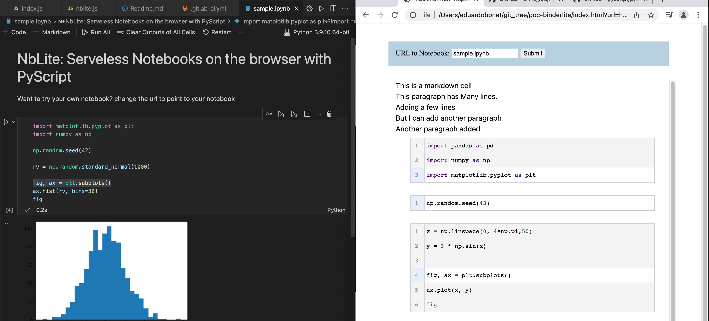

# NBLite: Minimalistic ClientSide Notebooks

Forked off of : https://eduardobonet.gitlab.io/nblite/ for educational purposed following Samuel Chan

NBLite is a proof of concept that creates a client side runnable version of a notebook, adding minimal styling and content, with the goal of exploring PyScript.

NBLite parses a notebook, creates the HTML, identifies the depedencies with 60 lines of javascript.

## Opening local files

To open a notebook locally, you will need to run your browser with CORS disabled:

- [Instruction on opening Chrome without CORS](https://stackoverflow.com/questions/3102819/disable-same-origin-policy-in-chrome)